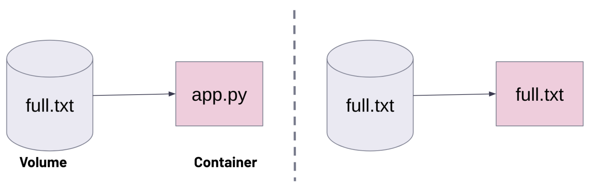

# Hands-on Docker-03 : Handling Docker Volumes

Purpose of the this hands-on training is to teach students how to handle volumes in Docker containers.

## Learning Outcomes 

At the end of the this hands-on training, students will be able to;

- explain what Alpine container is and why it is widely used.

- list available volumes in Docker.

- create a volume in Docker.

- inspect properties of a volume in Docker.

- locate the Docker volume mount point.

- attach a volume to a Docker container.

- attach same volume to different containers.

- delete Docker volumes.

## Outline

- Part 1 - Launch a Docker Machine Instance and Connect with SSH

- Part 2 - Data Persistence in Docker Containers

- Part 3 - Managing Docker Volumes

- Part 4 - Using Same Volume with Different Containers

- Part 5 - docker volume behaviours

- Part 6 - Bind Mounts

## Part 1 - Launch a Docker Machine Instance and Connect with SSH

- Launch a Docker machine on Ubuntu 24.04 AMI with security group allowing SSH connections using the [Cloudformation Template for Docker Machine Installation]

- Connect to your instance with SSH.

```bash
ssh -i .ssh/call-training.pem ubuntu@ec2-3-133-106-98.us-east-2.compute.amazonaws.com
```

## Part 2 - Data Persistence in Docker Containers

- Check if the docker service is up and running.

```bash
systemctl status docker
```

- Run an `alpine` container with interactive shell open, and add command to run alpine shell. Here, explain explain what the alpine container is and why it is so popular. (Small size, Secure, Simple, Fast boot)

```bash
docker run -it alpine ash
```

- Display the os release of the alpine container.

```bash
cat /etc/os-release
```

- Create a file named `short-life.txt` under `/home` folder

```bash
cd home && touch short-life.txt && ls
```

- Exit the container and return to ec2-user bash shell.

```bash
exit
```

- Show the list of all containers available on Docker machine.

```bash
docker image ls
docker ps -a
```

- Start the alpine container and connect to it.

```bash
docker start 737 && docker exec -it 737 ash
```

- Show that the file `short-life.txt` is still there, and explain why it is there. (Container holds it data until removed).

```bash
ls /home 
```

- Exit the container and return to ec2-user bash shell.

```bash
exit
```

- Remove the alpine container.

```bash
docker rm -f 737
```

- Show the list of all containers, and the alpine container is gone with its data.

```bash
docker ps -a
```

## Part 3 - Managing Docker Volumes

- Explain why we need volumes in Docker.

- List the volumes available in Docker, since not added volume before list should be empty.

```bash
docker volume ls
```

- Create a volume named `techpro-vol`.

```bash
docker volume create techpro-vol
```

- List the volumes available in Docker, should see local volume `techpro-vol` in the list.

```bash
docker volume ls
```

- Show details and explain the volume `techpro-vol`. Note the mount point: `/var/lib/docker/volumes/techpro-vol/_data`.

```bash
docker volume inspect techpro-vol
```

- List all files/folders under the mount point of the volume `techpro-vol`, should see nothing listed.

```bash
sudo ls -al  /var/lib/docker/volumes/techpro-vol/_data
```

- Run a `alpine` container with interactive shell open, name the container as `techpro`, attach the volume `techpro-vol` to `/techpro` mount point in the container, and add command to run alpine shell. Here, explain `--volume` and `v` flags.

```bash
docker run -it --name techpro -v techpro-vol:/techpro alpine ash
```

- List files/folder in `techpro` container, show mounting point `/techpro`, and explain the mounted volume `techpro-vol`.

```bash
ls
```

- Create a file in `techpro` container under `/techpro` folder.

```bash
cd techpro && echo "This file is created in the container techpro" > i-will-persist.txt
```

- List the files in `/techpro` folder, and show content of `i-will-persist.txt`.

```bash
ls && cat i-will-persist.txt
```

- Exit the `techpro` container and return to ubuntu bash shell.

```bash
exit
```

- Show the list of all containers available on Docker machine.

```bash
docker ps -a
```

- Remove the `techpro` container.

```bash
docker rm techpro
```

- Show the list of all containers, and the `techpro` container is gone.

```bash
docker ps -a
```

- List all files/folders under the volume `techpro-vol`, show that the file `i-will-persist.txt` is there.

```bash
sudo ls -al  /var/lib/docker/volumes/techpro-vol/_data && sudo cat /var/lib/docker/volumes/techpro-vol/_data/i-will-persist.txt
```

## Part 4 - Using Same Volume with Different Containers

- Run a `alpine` container with interactive shell open, name the container as `techpro2nd`, attach the volume `techpro-vol` to `/techpro2nd` mount point in the container, and add command to run alpine shell.

```bash
docker run -it --name techpro2nd -v techpro-vol:/techpro2nd alpine ash
```

- List the files in `/techpro2nd` folder, and show that we can reach the file `i-will-persist.txt`.

```bash
ls -l /techpro2nd && cat /techpro2nd/i-will-persist.txt
```

- Create an another file in `techpro2nd` container under `/techpro2nd` folder.

```bash
cd techpro2nd && echo "This is a file of the container techpro2nd" > loadmore.txt
```

- List the files in `/techpro2nd` folder, and show content of `loadmore.txt`.

```bash
ls && cat loadmore.txt
```

- Exit the `techpro2nd` container and return to ubuntu bash shell.

```bash
exit
```

- Run a `ubuntu` container with interactive shell open, name the container as `techpro3rd`, attach the volume `techpro-vol` to `/techpro3rd` mount point in the container, and add command to run bash shell.

```bash
docker run -it --name techpro3rd -v techpro-vol:/techpro3rd ubuntu bash
```

- List the files in `/techpro3rd` folder, and show that we can reach the all files created earlier.

```bash
ls -l /techpro3rd
```

- Create an another file in `techpro3rd` container under `/techpro3rd` folder.

```bash
cd techpro3rd && touch file-from-3rd.txt && ls
```

- Exit the `techpro3rd` container and return to ubuntu bash shell.

```bash
exit
docker ps -a
docker image ls
```

- Run an another `ubuntu` container with interactive shell open, name the container as `techpro4th`, attach the volume `techpro-vol` as read-only to `/techpro4th` mount point in the container, and add command to run bash shell.

```bash
docker run -it --name techpro4th -v techpro-vol:/techpro4th:ro ubuntu bash
```

- List the files in `/techpro4th` folder, and show that we can reach the all files created earlier.

```bash
ls -l /techpro4th
```

- Try to create an another file under `/techpro4th` folder. Should see error `read-only file system`

```bash
cd techpro4th && touch file-from-4th.txt
```

- Exit the `techpro4th` container and return to ubuntu bash shell.

```bash
exit
```

- List all containers.

```bash
sudo ls -al  /var/lib/docker/volumes/techpro-vol/_data
docker ps -a
```

- Delete `techpro2nd`, `techpro3rd` and `techpro4th` containers.

```bash
docker rm techpro2nd techpro3rd techpro4th
```

- Delete `techpro-vol` volume.

```bash
docker volume rm techpro-vol
```

## Part 5 - docker volume behaviours

|No | Situation   | Behaviour |
| ---- | ----------- | ------------ |
| 1    | If there is no target directory. | The target directory is created and files inside volume are copied to this directory. |
| 2    | If there is target directory, but it is empty. | The files in volume are copied to target directory.  |
| 3    | If there is target directory and it is not empty, but volume is empty. | The files in the target directory are copied to volumes. |
| 4    | If the volume is not empty. | There will be just the files inside the volume regardless of the target directory is full or empty. |

- Create `empty-vol` and `full-vol` volumes.

```bash
docker volume create empty-vol
docker volume create full-vol

docker volume ls
```

- Run an `alpine` container with interactive shell open, name the container as `vol-lesson`, attach the volume `full-vol` to `/techpro` mount point in the container, and add command to run alpine shell. 

```bash
docker run -it --name vol-lesson -v full-vol:/techpro alpine ash
```

- Create a file in `full-vol` container under `/techpro` folder.

```bash
cd techpro && echo "This file is created in the full-vol volume" > full.txt
```

- Exit the `vol-lesson` container and return to ubuntu bash shell.

```bash
exit
```

- List all files/folders under the volume `full-vol`, show that the file `full.txt` is there.

```bash
sudo ls /var/lib/docker/volumes/full-vol/_data
```

- Run the `techprodevops/test_app` container with interactive shell open, name the container as `techpro`, and show the inside of  directory.

```bash
docker run --rm -it --name techpro techprodevops/test_app sh
/ # ls
bin    dev    etc    home   lib    media  mnt    opt    proc   root   run    sbin   srv    sys    tmp    usr    var
/ # cd usr
/usr # ls
bin      lib      local    sbin     share    techpro
/usr # cd techpro
/usr/techpro # ls
app1  app2
```


- `exit` the container

### Situation-1 and 2:

|No | Situation   | Behaviour |
| ---- | ----------- | ------------ |
| 1    | If there is no target directory. | The target directory is created and files inside volume are copied to this directory. |
| 2    | If there is target directory, but it is empty. | The files in volume are copied to target directory.  |


- Run the `techprodevops/test_app` container with interactive shell open, name the container as `try1`, attach the volume `full-vol` to `/techpro` mount point in the container, and show that `/techpro` directory is created and files inside volume are copied to this directory.

```bash
docker run -it --name try1 -v full-vol:/techpro techprodevops/test_app sh
/ # ls
bin      etc      lib      mnt      proc     run      srv      techpro  usr
dev      home     media    opt      root     sbin     sys      tmp      var
/ # cd techpro && ls
full.txt
```

- `exit` the container


### Situation-3:

|No| Situation   | Behaviour |
| ---- | ----------- | ------------ |
| 3    | If there is target directory and it is not empty, but volume is empty. | The files in the target directory are copied to volumes. |


- List all files/folders under the volume `empty-vol`, show that the folder `is empty.

```bash
sudo ls /var/lib/docker/volumes/empty-vol/_data
```

- Run the `techprodevops/test_app` container with interactive shell open, name the container as `try2`, attach the volume `empty-vol` to `usr` mount point in the container.

```bash
docker run -it --name try2 -v empty-vol:/usr/techpro techprodevops/test_app sh
/ # ls
bin      etc      lib      mnt      proc     run      srv      usr
dev      home     media    opt      root     sbin     sys      tmp      var
/ # cd usr/techpro/
/usr/techpro # ls
app1  app2
/usr/techpro # exit

```

- `exit` the container.

- List all files/folders under the volume `empty-vol`, show that the file `app1 app2` is there.

```bash
sudo ls /var/lib/docker/volumes/empty-vol/_data
app1  app2
```

### Situation-4:

|No    | Situation   | Behaviour |
| ---- | ----------- | ------------ |
| 4    | If the volume is not empty. | There will be just the files inside the volume regardless of the target directory is full or empty. |



- List all files/folders under the volume `full-vol`, show that the file `full.txt` is there.

```bash
sudo ls /var/lib/docker/volumes/full-vol/_data
full.txt
```

- Run the `techprodevops/test_app` container with interactive shell open, name the container as `try3`, attach the volume `full-vol` to `/usr/techpro` mount point in the container, and show that we just see the files inside volume regardless of  the target directory is full or empty.

```bash
docker run -it --name try3 -v full-vol:/usr/techpro techprodevops/test_app sh
/ # ls
bin      etc      lib      mnt      proc     run      srv      usr
dev      home     media    opt      root     sbin     sys      tmp      var
/ # cd usr/techpro/
/usr/techpro # ls
full.txt
/usr/techpro # exit
```

- `exit` the container

- Remove all volumes and containers and list them.

```bash
docker container prune
docker volume rm empty-vol full-vol
docker volume ls
docker container ls
```

## Part 6 - Bind Mounts
- Run the `nginx` container at the detached mod, name the container as `nginx-default`, and open <public-ip> on browser and show the nginx default page.

```bash
docker run -d --name nginx-default -p 80:80  nginx
```

- Add a security rule for protocol HTTP port 80 and show Nginx Web Server is running on Docker Machine.

```text
http://<public-ip>:80
```

- Attach the `nginx` container, show the index.html in the /usr/share/nginx/html directory.

```bash
docker exec -it nginx-default bash
root@4a1c7e5f394a:/# cd /usr/share/nginx/html
root@4a1c7e5f394a:/usr/share/nginx/html# ls
50x.html  index.html
root@4a1c7e5f394a:/usr/share/nginx/html# cat index.html
```

- `exit` the container

- Create a folder named  webpage, and an index.html file.

```bash
mkdir webpage && cd webpage
echo "<h1>Welcome to techpro</h1>" > index.html
ls
```

- Run the `nginx` container at the detached mod, name the container as `nginx-new`, attach the directory `/home/ubuntu/webpage` to `/usr/share/nginx/html` mount point in the container, and open <public-ip> on browser and show the web page.

```bash
docker run -d --name nginx-new -p 8080:80 -v /home/ubuntu/webpage:/usr/share/nginx/html nginx
```

- Add a security rule for protocol HTTP port 8080 and show Nginx Web Server is running on Docker Machine.

```text
http://<public-ip>:8080
```

- Attach the `nginx` container, show the index.html in the /usr/share/nginx/html directory.

```bash
docker exec -it nginx-new bash
root@a7e3d276a147:/# cd usr/share/nginx/html
root@a7e3d276a147:/usr/share/nginx/html# ls 
index.html
root@a7e3d276a147:/usr/share/nginx/html# cat index.html 
<h1>Welcome to techpro</h1>
```

- `exit` the container.

- Add `<h2>This is added for docker volume lesson</h2>` line to index.html in the /home/ubuntu/webpage folder and check the web page on browser.

```bash
echo "<h2>This is added for docker volume lesson</h2>" >> index.html
```

- Remove the containers.

```bash
docker rm -f nginx-default nginx-new
docker container prune
```

- Remove the volumes.

```bash
docker volume prune -f
```